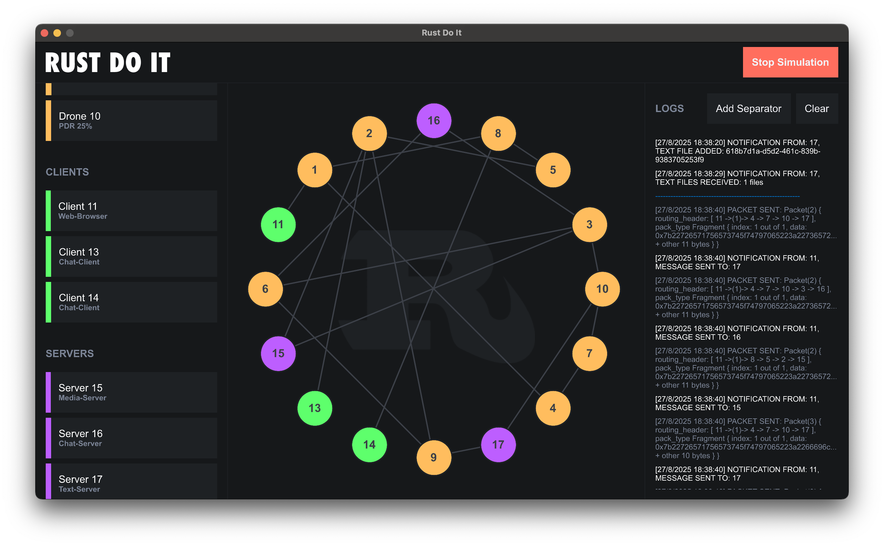

# Simulation Controller

## Overview

This repository contains the Simulation Controller. The larger project involves developing a simulated drone network for communication between clients and servers, handling unreliable conditions like packet drops and node crashes using protocols for discovery, routing, and reliable delivery. This controller acts as the central management tool.

## What It Does

The Simulation Controller provides a graphical user interface (built with Slint) to:
- **Initialize and Run Simulations**: Load network topologies from initialization files, start drones/clients/servers, and set up communication channels.
- **Monitor the Network**: Visualize the graph of nodes (drones, clients, servers) and edges in real-time, including dynamic updates for crashes or changes.
- **Handle Events**: Listen to events from nodes (e.g., file transfers, chat messages, errors) and drones (e.g., crashes, packet drops), logging them in the UI and saving data like files or chat histories to disk.
- **Inject Controls**: Send commands to nodes via the UI, such as querying file lists, adding/removing files, registering chat clients, or simulating failures (e.g., dropping packets with configurable probabilities).
- **Ensure Reliability**: Integrates with the project's protocols to handle unreliability, notifying nodes of failures and ensuring eventual packet delivery without network partitions.

It uses crossbeam channels for event handling, Rust's standard library for file I/O, and libraries like `chrono` for timestamps and `uuid` for unique identifiers. The code emphasizes idiomatic Rust, extensive testing (see `test.rs`), and adherence to project principles (no unsafe code, no undocumented panics).

## Dependencies

See `Cargo.toml` for details, including `slint` for UI, `crossbeam` for concurrency, and project-specific crates like `common` and `network-initializer`.

## Running

1. Clone the repository and ensure dependent crates (e.g., from GitHub) are accessible.
2. Run `cargo build` to compile.
3. Execute `cargo run` to launch the UI and start a simulation (provide a network initialization file path via the UI or code).
4. Use the interface to load topologies, start/stop simulations, and interact with nodes.